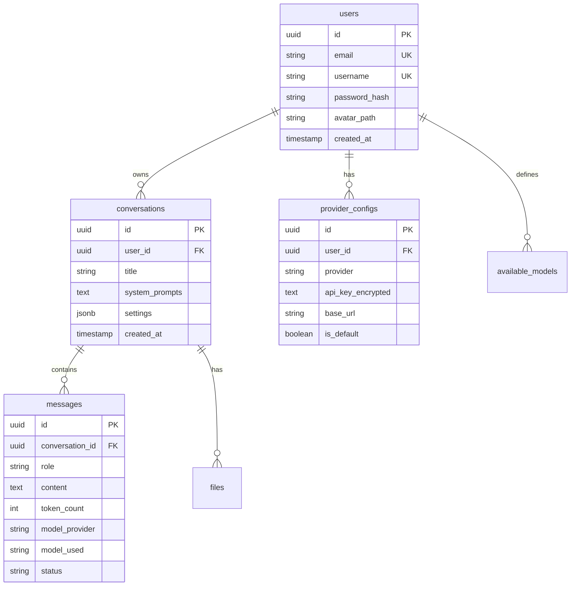

# 🤖 Multi-Provider AI Chatbot

<div align="center">

**A modern, full-stack chatbot application supporting multiple AI providers with conversation management, streaming responses, and secure authentication.**

[](https://www.typescriptlang.org/)
[](https://www.postgresql.org/)
[](https://reactjs.org/)
[](https://www.docker.com/)
[](LICENSE)

[Features](#-features) • [Demo](#-demo) • [Installation](#-installation) • [Usage](#-usage) • [Architecture](#-architecture) • [API Documentation](#-api-documentation)

</div>

---

## 📸 Demo

<div align="center">


*Clean, modern interface with dark theme support and seamless provider switching*

</div>

---

## ✨ Features

### 🔌 Multiple AI Provider Support
Connect to your favorite AI providers with seamless switching:
- **OpenAI** (GPT-4, GPT-3.5)
- **Anthropic** (Claude 3.5 Sonnet)
- **Google** (Gemini 2.5 Flash)
- **xAI** (Grok)
- **DeepSeek** (DeepSeek Coder)
- **Ollama** (Local models)
- **HuggingFace** (Open-source models)

### 💬 Conversation Management
- Create, rename, and delete conversations
- Persistent chat history stored in PostgreSQL
- Message regeneration with different providers
- Real-time streaming responses

### 🔐 Secure Authentication
- JWT-based authentication
- Bcrypt password hashing
- Protected API routes
- User-specific API key encryption

### 🎨 Modern UI/UX
- Responsive design with Tailwind CSS
- Dark/Light theme support
- Smooth animations and transitions
- Mobile-friendly interface
- Easy API key management from the UI

### 🚀 Developer-Friendly
- Full TypeScript implementation
- Docker support for easy deployment
- RESTful API design
- Comprehensive error handling

---

## 🛠️ Tech Stack

### Frontend
- **Framework**: React 19 with React Router 7
- **Styling**: Tailwind CSS 4
- **Language**: TypeScript
- **Build Tool**: Vite

### Backend
- **Runtime**: Node.js
- **Framework**: Express.js 5
- **AI SDK**: Vercel AI SDK
- **Authentication**: JWT + Bcrypt
- **Language**: TypeScript

### Database
- **Primary**: PostgreSQL 18
- **ORM**: Raw SQL queries (no ORM)
- **Features**: UUID v7, Triggers, Indexes

### DevOps
- **Containerization**: Docker + Docker Compose
- **Package Manager**: pnpm

---

## 📦 Installation

### Prerequisites

- **Docker & Docker Compose** (recommended)
- **Node.js 18+** and **pnpm** (for manual setup)
- **PostgreSQL 14+** (for manual setup)

### 🐳 Quick Start with Docker (Recommended)

1. **Clone the repository**
   ```bash
   git clone https://github.com/mohammad53eu/chatbot-website.git
   cd chatbot-website
   ```

2. **Configure environment variables**
   
   Create a `.env` file in the root directory:
   ```bash
   cp .env.example .env
   ```

   Edit `.env` with your credentials:
   ```env
   # ----------------------------
   # Postgres Credentials
   # ----------------------------
   POSTGRES_DB=chatbot_db
   POSTGRES_HOST=postgres
   POSTGRES_PORT=5432
   POSTGRES_USER=postgres
   POSTGRES_PASSWORD=your_secure_password
   
   # ----------------------------
   # Backend environment
   # ----------------------------
   BACKEND_PORT=4000
   BACKEND_JWT_SECRET=your_jwt_secret_min_32_characters_long
   BACKEND_JWT_EXPIRES_IN=24h
   BACKEND_BCRYPT_ROUNDS=12
   BACKEND_ENCRYPTION_KEY=your_encryption_key_32_chars
   
   # ----------------------------
   # Frontend environment
   # ----------------------------
   FRONTEND_PORT=3000
   ```

   > ⚠️ **Security Note**: Change all default secrets before deploying to production!

3. **Start the application**
   ```bash
   docker-compose up -d
   ```

4. **Access the application**
   - Frontend: http://localhost:3000
   - Backend API: http://localhost:4000

5. **Stop the application**
   ```bash
   docker-compose down
   ```

---

### 🔧 Manual Setup (Alternative)

<details>
<summary>Click to expand manual installation steps</summary>

#### 1. Setup PostgreSQL Database

```bash
# Create database
psql -U postgres
CREATE DATABASE chatbot_db;
\q

# Run initialization script
psql -U postgres -d chatbot_db -f db/init.sql
```

#### 2. Setup Backend

```bash
cd backend
pnpm install

# Create .env file
cp .env.example .env
```

Edit `backend/.env`:
```env
PORT=4000

JWT_SECRET=your_jwt_secret_change_me
JWT_EXPIRES_IN=24h
BCRYPT_ROUNDS=12

DB_HOST=localhost
DB_PORT=5432
DB_NAME=chatbot_db
DB_USER=postgres
DB_PASSWORD=your_password

ENCRYPTION_MASTER_KEY=your_encryption_key_32_chars
```

Start the backend:
```bash
pnpm dev    # Development mode
pnpm build  # Production build
pnpm start  # Production mode
```

#### 3. Setup Frontend

```bash
cd frontend
pnpm install

# Create .env (optional)
echo "PORT=3000" > .env
```

Start the frontend:
```bash
pnpm dev    # Development mode
pnpm build  # Production build
pnpm start  # Production mode
```

</details>

---

## 🚀 Usage

### 1. Register an Account

Navigate to http://localhost:3000 and click **Register**:
- Provide email, username, and password
- Password requirements:
  - Minimum 8 characters
  - At least one uppercase letter
  - At least one lowercase letter
  - At least one number
  - At least one special character

### 2. Add AI Provider API Keys

After logging in:
1. Click the **provider selector** in the chat input area
2. Select your preferred AI provider (e.g., OpenAI, Anthropic)
3. Paste your API key
4. Click **Save**

> 💡 **Tip**: API keys are encrypted and stored securely in the database. You can switch between providers without re-entering keys.

### 3. Start Chatting!

- Type your message in the input box
- Press **Enter** or click **Send**
- Watch the AI response stream in real-time
- Switch providers anytime to compare responses

### 4. Manage Conversations

- **Create**: Click the "+" button in the sidebar
- **Rename**: Click the ✏️ icon next to a conversation
- **Delete**: Click the 🗑️ icon to remove a conversation
- **Switch**: Click any conversation to load its history

---

## 🏗️ Architecture

### Project Structure

```
chatbot-website/
├── backend/
│   ├── src/
│   │   ├── config/           # Provider configurations
│   │   ├── controllers/      # Request handlers
│   │   ├── database/         # DB connection & queries
│   │   ├── middleware/       # Auth middleware
│   │   ├── routes/           # API routes
│   │   ├── services/         # Business logic
│   │   ├── types/            # TypeScript types
│   │   └── utils/            # Helper functions
│   ├── Dockerfile
│   └── package.json
│
├── frontend/
│   ├── app/
│   │   ├── routes/           # React Router pages
│   │   ├── components/       # React components
│   │   ├── context/          # React context
│   │   └── auth/             # Auth pages
│   ├── Dockerfile
│   └── package.json
│
├── db/
│   └── init.sql              # Database schema
│
├── docker-compose.yml
├── .env.example
└── README.md
```

### Database Schema



---

## 📡 API Documentation

### Authentication Endpoints

#### Register User
```http
POST /api/auth/register
Content-Type: application/json

{
  "email": "user@example.com",
  "username": "username",
  "password": "SecurePass123!@#"
}
```

#### Login
```http
POST /api/auth/login
Content-Type: application/json

{
  "email": "user@example.com",
  "password": "SecurePass123!@#"
}
```

### Chat Endpoints

All chat endpoints require authentication:
```http
Authorization: Bearer <your_jwt_token>
```

#### List Conversations
```http
GET /api/chat/conversations
```

#### Create Conversation
```http
POST /api/chat/conversations
Content-Type: application/json

{
  "settings": {
    "temperature": 0.7
  }
}
```

#### Get Conversation Details
```http
GET /api/chat/conversations/:id
```

#### Send Message (Streaming)
```http
POST /api/chat/conversations/:id/messages
Content-Type: application/json

{
  "content": "Hello, AI!",
  "model_provider": "openai",
  "model_name": "gpt-4o"
}
```

Response format (Server-Sent Events):
```
data: {"delta": "Hello"}
data: {"delta": " there!"}
data: {"done": true}
```

#### Rename Conversation
```http
PATCH /api/chat/conversations/:id
Content-Type: application/json

{
  "title": "New Conversation Title"
}
```

#### Delete Conversation
```http
DELETE /api/chat/conversations/:id
```

### Provider Endpoints

#### Save API Key
```http
POST /api/provider/upsert
Content-Type: application/json
Authorization: Bearer <token>

{
  "provider": "openai",
  "api_key": "sk-...",
  "base_url": "https://api.openai.com/v1"
}
```

#### Get Provider Models
```http
GET /api/provider/:provider/models
Authorization: Bearer <token>
```

> 📚 For complete API documentation, see [backend/ROUTES.md](backend/ROUTES.md)

---

## 🔒 Security Features

- ✅ **Password Hashing**: Bcrypt with configurable salt rounds
- ✅ **JWT Authentication**: Secure token-based authentication
- ✅ **API Key Encryption**: Provider API keys encrypted at rest
- ✅ **SQL Injection Prevention**: Parameterized queries
- ✅ **Input Validation**: Email format, password strength
- ✅ **CORS Protection**: Configured CORS middleware
- ✅ **Helmet.js**: Security headers

---

## 🗺️ Roadmap

### Planned Features

- [ ] **File Support**
  - Upload files to conversations
  - AI-generated file downloads
- [ ] **Web Search Integration**
  - Real-time web search capability
  - Source citation
- [ ] **Advanced Tools**
  - Calculator
  - Code execution
  - Custom tool integration
- [ ] **Model Management**
  - Custom model configurations
  - Cost tracking per model
- [ ] **Team Features**
  - Shared conversations
  - Role-based access control

---

## 🤝 Contributing

Contributions are welcome! Feel free to:
- Report bugs
- Suggest new features
- Submit pull requests
- Improve documentation

Please open an issue first to discuss major changes.

---

## 📝 License

This project is licensed under the **MIT License** - see the [LICENSE](LICENSE) file for details.

---

## 🙏 Acknowledgments

- [Vercel AI SDK](https://sdk.vercel.ai/) for the AI integration
- [React Router](https://reactrouter.com/) for routing
- [Tailwind CSS](https://tailwindcss.com/) for styling
- All the amazing AI providers making this possible

---

## 👥 Authors

- **[@mohammad53eu](https://github.com/mohammad53eu)** - Backend Development, Database Design, API Architecture
- **[@Motasem-Ali-A](https://github.com/Motasem-Ali-A)** - Frontend Development, UI/UX Design

---

## 📧 Contact

**Project Link**: [https://github.com/mohammad53eu/chatbot-website](https://github.com/mohammad53eu/chatbot-website)

**Issues**: [Report a bug or request a feature](https://github.com/mohammad53eu/chatbot-website/issues)

---

<div align="center">

**⭐ Star this repo if you find it useful!**

Made with ❤️ and TypeScript

</div>
